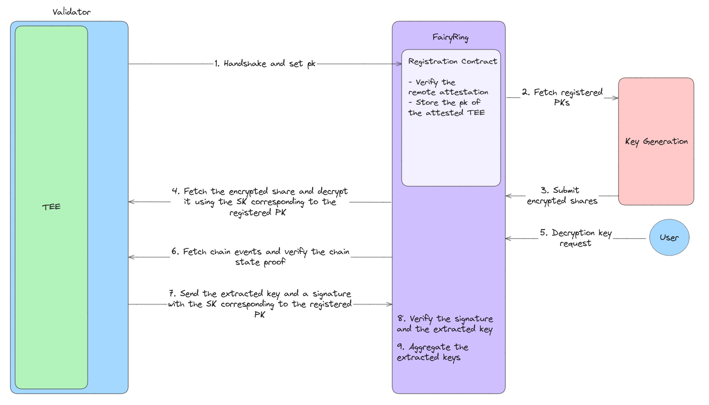

# Fairblock-Cycles-Quartz

## 1. Why Fairblock-Cycles-Quartz?

Fairblock-Cycles-Quartz is built to enhance the security and reliability of validator operations within the Fairyring network. Validators are essential to the blockchain's integrity, but there is always a risk of collusion among them that can compromize the system. To address this, Fairblock-Cycles-Quartz uses the Cycles-Quartz library, allowing validator operations to run within a Trusted Execution Environment (TEE), which helps keep sensitive operations secure.

Our [Multimodal Cryptography Series – Accountable MPC + TEE](https://hackmd.io/@Fairblock/rkSiU78TR) explains the risks of validator collusion and the impact on blockchain integrity. One major risk is validators leaking decryption keys prematurely. Fairblock-Cycles-Quartz tackles this by ensuring validators are unaware of their own shares. Running key processes inside a TEE ensures that sensitive data remains isolated and verifiable through on-chain attestation.

## 2. System Architecture

### 2.1 Validator Registration
Validator registration in Fairblock-Cycles-Quartz is managed through a CosmWasm smart contract that interacts with TEEs across the Fairyring network. Registration starts with a handshake between the CosmWasm contract and an enclave, using the Quartz client. Once this handshake is complete, the enclave's public key is saved in a list maintained by the contract, which holds the public keys of authorized TEEs. This list is later used to verify messages coming from registered enclaves.

### 2.2 Secure Validator Operations
After registration, the validator public keys are retrieved from the CosmWasm contract. Each validator receives a share, which is encrypted with their registered public key and sent on-chain. Enclaves fetch these encrypted shares and decrypt them within the secure TEE environment, using their corresponding secret keys. This setup ensures that validators do not access their own shares directly, thereby reducing the risk of collusion.

The enclaves also monitor the blockchain for requests to provide decryption keys. When such a request comes in, the enclave uses Tendermint's `abci_query` to verify the request against the blockchain state. Once verified, the enclave extracts the keyshare and signs it using the secret key held in the TEE. The signed share is submitted back to Fairyring, where it is validated against the stored public keys. This ensures the message came from a valid, authenticated TEE, allowing the extracted keyshare to be used for further aggregation.

The diagram below shows the entire process:

## 3. Implementation Details

This implementation builds upon the `Transfers` example from Cycles-Quartz, with modifications to the Quartz client to enable contract deployment and interaction with Fairyring.

### 3.1 Contract and Enclave Modifications
The CosmWasm contract has been updated to keep a list of public keys from enclaves that successfully complete the handshake process. On the enclave side, extra functionalities have been added to handle validator-specific tasks for Fairyring. The enclave first waits for the handshake to complete and the secret key (SK) to be set. Once ready, the enclave retrieves and decrypts its share. Afterward, it listens to the Fairyring network for decryption key requests, verifies these requests, extracts the required keyshare, and submits it back to the chain.

## 4. Testing

Testing for Fairblock-Cycles-Quartz involves two main scripts: `test.sh` and `test-tee.sh`. The `test.sh` script is for end-to-end tests without TEE integration, while `test-tee.sh` also includes extra steps for deploying and managing TEE components, such as the TCB and DCAP contracts.

### 4.1 Test Procedures
The testing involves several key steps:

- **Network Initialization**: Start the Fairyring network.
- **Enclave Setup**: Build and initialize the enclave.
- **Contract Deployment**: Deploy the CosmWasm contract and complete the handshake with the enclave to validate the TEE.
- **Share Encryption**: Encrypt the validator's share using the enclave's public key and send it on-chain.
- **Decryption Key Request**: Submit decryption key requests to trigger the enclave's process.

For end-to-end tests, the Fairyring source code (`abci-query` branch) must be cloned in the same directory as Fairblock-Cycles-Quartz.
Logs for both the blockchain and enclave are kept for analysis and debugging purposes, stored in `fairyring/fairyring_chain.log` and `examples/fairblock/enclave_output.log`. These logs provide insight into the behavior of the enclave and chain interactions during testing.

## 5. Performance Analysis

The performance of cryptographic operations was analyzed under environments with and without TEE integration. Specifically, we evaluated the average runtime of operations related to key extraction, signing and sending transactions on-chain, and share retrieval. Each operation was executed 100 times, and the results were averaged to determine the runtime. All experiments were conducted on a Microsoft Azure virtual machine configured as a **Standard DC4s v3 instance**, equipped with **4 vCPUs** and **32 GiB of RAM**.

### 5.1 Experimental Results

The following table summarizes the average runtime of each operation executed both in a standard environment (without TEE) and in a TEE-enabled environment. The overhead percentage shows the additional runtime cost due to TEE integration.

| Operation                  | Standard Environment Runtime Average (ms) | TEE-Enabled Runtime Average (ms) | Overhead (%) |
|----------------------------|------------------------------------|--------------------------|--------------|
| Key Extraction             | 1.626                            | 1.714                   | +5.41%       |
| Signing & Sending Keyshare on-Chain | 81.8016                            | 89.7137                  | +9.68%       |
| Share Retrieval            | 40.9942                            | 44.2842                  | +8.02%       |

### 5.2 Overhead Analysis

The results show that integrating TEE introduces a moderate runtime overhead across all operations. Key extraction shows the lowest overhead, with an increase of **5.41%**. In contrast, signing and sending transactions on-chain shows the highest observed overhead, at **9.68%**. The share retrieval operation experienced an overhead of **8.02%**.

These findings suggest that while using a TEE does introduce a runtime cost, this overhead is limited to a maximum of **9.68%** across the cryptographic operations. This level of overhead is acceptable given the enhanced security guarantees provided by TEE integration. Overall, the results demonstrate that TEE integration maintains an efficient framework suitable for critical operations, including key extraction, signing, and share decryption, even when interacting with blockchain networks.
