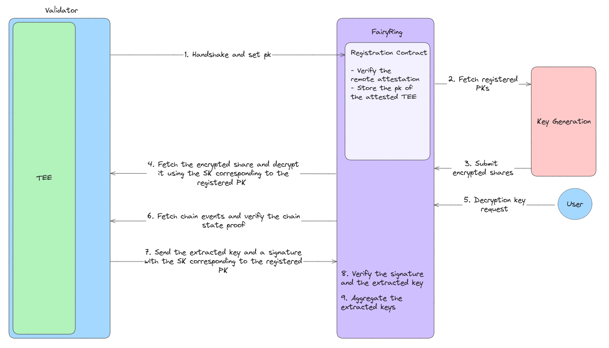

# Fairblock-Cycles-Quartz

We plan to have our validators run the FairyringClient code inside TEEs to prevent their direct access to their shares. For this, we can use the provided Cycles-Quartz libraries to perform on-chain attestation of the TEEs by having a registration CosmWasm contract on FairyRing. The registration contract performs the handshake with validators' TEEs and stores their Public Keys (PKs).

After the registration, the PKs will be fetched from the contract. Each validator's share will be encrypted with their registered PK, and the encrypted shares will be sent on-chain. The TEEs can fetch the shares and decrypt them inside the enclave using the corresponding Secret Key (SK). This way, the validators will have no knowledge of their shares.

Once there is a need for a decryption key, the event will be monitored by the enclave code and verified through the client proofs. Since we are verifying the chain state, we will use the Tendermint abci_query for verification. The keyshare will be extracted inside the enclave, then it will be signed using the SK (corresponding to the PK stored inside the CosmWasm contract) and sent on-chain. The signature can be verified on-chain using the registered PK to ensure that the request comes from inside the TEE, and then the extracted key can be used for aggregation.

For the base of our implementation, we are using this provided Transfers example.

Below is a diagram of the steps:
